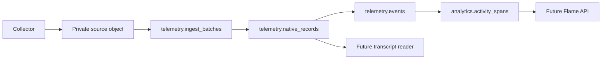
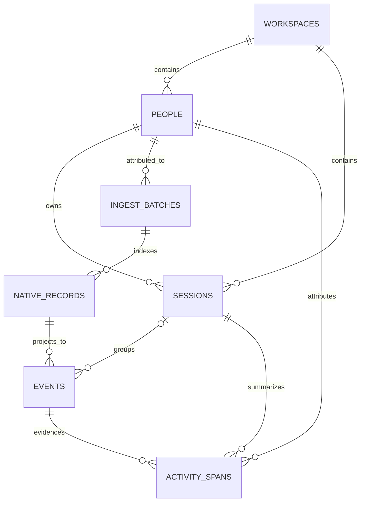

# Sherlock v0 Data Architecture

Status: the Supabase database foundation is implemented. The collector drain,
normalizer, snapshot resolver, and Flame read APIs are not implemented yet.

Sherlock keeps raw telemetry immutable, database facts auditable, and product
views separate from source data. The database is intentionally small: seven
tables across two private schemas and one private Storage bucket.

## Sources of truth

Use these in order:

1. [`supabase/migrations/20260814225047_initial_sherlock_schema.sql`](../supabase/migrations/20260814225047_initial_sherlock_schema.sql)
   is authoritative for exact columns, constraints, indexes, roles, grants,
   and bucket configuration.
2. [`supabase/tests/database/schema.test.sql`](../supabase/tests/database/schema.test.sql)
   verifies the security and integrity properties on a real database.
3. This document explains responsibilities, relationships, and application
   behavior that SQL alone cannot enforce.

Do not copy the migration's full column or index lists into this document.
Keeping one exact definition prevents the architecture notes from drifting.

## Implemented foundation

- Supabase local configuration targets PostgreSQL 17.
- `telemetry` stores source receipts, native record locators, and normalized
  facts.
- `analytics` stores rebuildable activity projections.
- Both schemas are private and excluded from the configured Data API schemas.
- `public`, `anon`, and `authenticated` have no access to either schema or its
  tables and sequences.
- The private `telemetry-raw` bucket accepts gzip and binary objects up to
  50 MiB.
- Three no-login database roles separate ingest, normalization, and reads.
- Thirty-six database assertions cover the core schema, grants, bucket, and
  representative integrity failures.

The migration does not create Storage object policies or a user-facing
permission model. Future services must connect server-side and assume only the
appropriate database role. If a private table is ever exposed through the Data
API, add explicit grants and row-level security together.

## Target data flow



The drain will put complete source bytes in Storage. PostgreSQL will contain
immutable receipts and locators plus versioned interpretations. Complete
prompts, messages, reasoning, tool payloads, and native JSON do not belong in
database columns.

## The seven tables

| Table | Responsibility | Writer behavior |
| --- | --- | --- |
| `telemetry.workspaces` | Team and tenant boundary | Provisioned administratively |
| `telemetry.people` | Stable human attribution inside a workspace | Provisioned administratively |
| `telemetry.sessions` | Current cache for one native Codex execution stream | Normalizer may insert and update |
| `telemetry.ingest_batches` | Receipt for one committed source byte range and Storage object | Ingest may insert only |
| `telemetry.native_records` | Exact locator and parse status for each native record | Ingest may insert only |
| `telemetry.events` | Versioned semantic projections of native records | Normalizer may insert only |
| `analytics.activity_spans` | Versioned, rebuildable activity intervals | Normalizer may insert only |

Append-only behavior is enforced for application roles through grants. A
database owner can still perform administrative maintenance and therefore
remains outside the application trust boundary.

### Relationships



Repeated `workspace_id` values use composite foreign keys where facts cross
tables. This prevents a child row from citing a person, session, batch, record,
or event from another workspace. Span evidence is also constrained to the same
session.

### Sessions are mutable caches

A session represents one native Codex execution stream. Primary tasks and
workers are separate sessions. Resumes with the same native session ID update
the same row; a new native session ID creates another row and may share a
`native_thread_id`.

Resolved parent, role, title, repository, branch, working directory, model, and
time bounds are current caches. Historical queries must use versioned events
and spans rather than assuming those cached values were always true.

The first successfully normalized batch for a native session must determine
its person. A later batch with different immutable person attribution is an
application error; it must not rewrite `sessions.person_id`.

### Ingest batches and native records are source facts

An ingest batch identifies a non-empty half-open byte range `[start, end)`, its
source and stored hashes, the Storage path, encoding, generation, record count,
and authenticated person attribution. Its `person_id` is fixed at commit time
and is never inferred again from mutable credential configuration.

Native records locate every source record, including unknown or malformed
ones. They remain separate from events because one native record may produce
multiple semantic events and later normalizer versions may reinterpret it.

The database enforces hashes, positive ranges and sizes, controlled values,
uniqueness, and tenant-consistent foreign keys. The drain must enforce the
cross-row stream rules described below.

### Events are versioned interpretations

Events are sparse, typed projections. Fields required by activity, usage,
health, lineage, and transcript queries are columns; small non-query labels may
use bounded JSON. Full content is retrieved through the native record and its
batch object.

`(source_record_id, normalizer_version, projection_index)` identifies one
projection. `session_id` is nullable because collector-only or unresolved
records may not yet have semantic session attribution. Unknown or irrelevant
records still need an `unknown` or `ignored` event so normalization coverage is
observable.

Normalizer versions must be immutable build or content identifiers. Mutable
aliases such as `latest` cannot reproduce an older interpretation.

### Activity spans are rebuildable

Activity spans are append-only revisions of logical intervals. A later row
with the same `span_key` and activity version supersedes an earlier row for a
newer event cutoff. Tombstones remove intervals for newer snapshots without
deleting history.

Spans copy the person, role, and event-time project dimensions needed by Flame
queries so those queries do not depend on mutable session caches. They are
still derived data: selected events plus an immutable `activity_version` must
be sufficient to rebuild them.

Flame frames and daily aggregates are not database facts and are not stored in
v0. A read response may be cached by immutable snapshot and query parameters.

## Database roles

| Role | Access |
| --- | --- |
| `sherlock_ingest` | Read workspace, person, batch, and native-record metadata; insert batches and native records |
| `sherlock_normalizer` | Read telemetry; insert/update session caches; insert events and activity spans |
| `sherlock_reader` | Read telemetry and analytics; no writes |

The ingest role cannot write events or spans. The normalizer cannot update or
delete batches, native records, events, or spans. The reader cannot write any
fact. These grants separate collection from interpretation and product reads.

## Required drain contract

The next implementation must preserve these rules. They are application
requirements unless the migration explicitly enforces them.

1. Authenticate the collector on the server and derive `workspace_id`,
   `person_id`, and the permitted `collector_key`. Never trust client-supplied
   tenancy or person attribution.
2. Durably spool a source chunk and its encoded object once. Retries must reuse
   the exact bytes rather than recompressing them.
3. Upload to a content-addressed path with overwrite disabled. If the object
   already exists, verify its stored size and hash before continuing.
4. In a short database transaction, lock the source stream and recheck the
   requested range. An exact identity, range, and hash retry returns the
   existing receipt; overlaps, conflicting hashes, and inconsistent generation
   mappings are rejected.
5. Insert the batch and all native-record locators atomically. Validate that
   record ranges are ordered, unique, contained by the batch, and equal the
   declared record count.
6. Return a versioned committed receipt containing the stable stream,
   generation, byte range, hashes, batch ID, and authenticated attribution.
7. Delete the local spool item only after every receipt identity field matches.
   A successful Storage upload alone is not an acknowledgement.

Storage and database writes cannot be one transaction. Recovery must converge
in both expected failure windows:

- Storage succeeded but the database failed: verify the existing object and
  retry the database insert.
- The database committed but the response was lost: return the existing exact
  receipt.

An orphaned object from a rejected conflict is operational cleanup, not a
queryable telemetry fact.

## Planned application behavior

The current migration does not implement these behaviors:

- advisory-lock protocols for stream registration or ordered normalization;
- exact-retry receipt lookup and range-overlap detection;
- generation-key/sequence consistency across multiple batches;
- native-record containment, ordering, and declared-count validation;
- normalizer sealing, canonical event selection, or replay suppression;
- activity reduction and version activation;
- signed snapshot tokens and contiguous publication cutoffs;
- transcript, usage, health, coverage, or Flame read APIs.

Implement each behavior in service code with integration tests. Do not describe
it as a database guarantee until a constraint or verified transaction protocol
actually enforces it.

## Conventions

- Entity IDs are UUIDs; high-volume append-only fact IDs are identity
  `bigint`s.
- Times are `timestamptz`. Source, observed, and server-received times remain
  distinct.
- Time and byte ranges are half-open: `[start, end)`.
- SHA-256 values are lowercase hexadecimal.
- Required identity text is non-empty.
- JSON is bounded and cannot replace typed fields used by core queries.
- Codex is the only provider in v0. Generalize after a second provider provides
  real requirements.
- Use keyset pagination for ordered fact reads.
- Do not partition until measured scale or retention work justifies it.

## Deferred

- end-user membership, authorization policies, and Data API read surfaces;
- separate installation, thread, run, edge, or classification tables;
- stored Flame frames, daily aggregates, builds, or snapshots;
- editable project and repository catalogs;
- incidents, alerts, transcript search, embeddings, and recommendations;
- multi-provider normalization, warehouse export, and partitioning.

Deferring the user-facing permission model does not defer service
authentication, immutable attribution, or write isolation.

## Verification

After a schema change, rebuild or migrate a clean database and run:

```sh
supabase db query --linked --file supabase/tests/database/schema.test.sql
supabase db lint --linked --schema telemetry,analytics --level warning --fail-on error
supabase db advisors --linked --type all --level warn --fail-on error
```

The migration and tests must change together whenever the implemented contract
changes.
