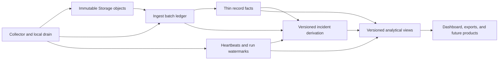
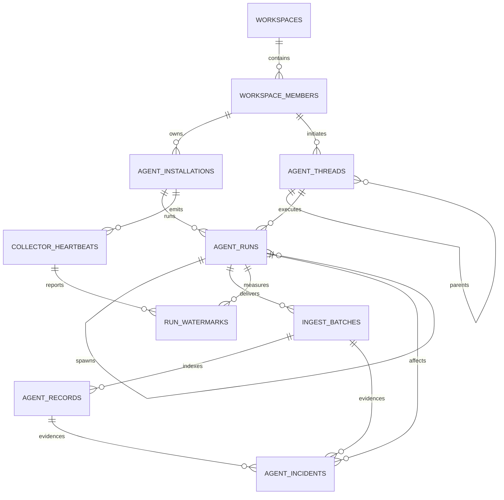

# Sherlock Data Schema

Status: proposed source-of-truth contract for v0.

This document defines the durable data model for Sherlock. It is intentionally
product-agnostic: dashboards, flame graphs, alerts, exports, and future analyses
must be derived from these facts rather than becoming new sources of truth.

## Goals

- Preserve every supported agent thread, subagent, prompt, message, tool event,
  usage observation, lifecycle event, and unknown native record.
- Make every indexed fact traceable to exact immutable source bytes.
- Make root/parent/spawn lineage and activity ownership explicit.
- Distinguish agent silence from collector, capture, upload, and normalization
  failures using independent heartbeats and per-run watermarks.
- Keep Postgres small and fast by storing complete transcript bodies and native
  payloads in object storage.
- Keep labels controlled, versioned, understandable, and forward-compatible.
- Support live views and arbitrary historical analysis from the same facts.
- Allow new collectors, normalizers, incident rules, and product views without
  rewriting raw history.

## Non-goals

- Ten-minute windows, flame buckets, and UI groupings are not stored facts.
- Postgres is not the transcript warehouse.
- A recent message does not prove an agent is active.
- A missing message does not prove an agent or collector is stalled.
- Unknown native records are not dropped or coerced into a known type.

## System boundaries



Storage owns complete evidence. Postgres owns identity, lineage, delivery
receipts, compact analytical facts, health observations, and evidence-backed
incident assertions.

## Database organization

- `telemetry`: durable fact tables.
- `analytics`: versioned views and optional rebuildable materializations.
- `private`: internal ingest functions and operational helpers that must not be
  exposed through the Data API.

All exposed tables use explicit grants and RLS. Exposed views must use
`security_invoker = true`. Product code should prefer `analytics` views and a
transcript-reading API over direct access to telemetry tables.

## Entity overview



## Common conventions

- Entity identifiers use `uuid`.
- High-volume append-only fact identifiers may use `bigint generated always as
  identity`.
- All timestamps use `timestamptz`.
- Text uses `text` plus explicit checks where controlled values are required.
- Byte offsets use zero-based, half-open ranges: `[start_offset, end_offset)`.
- Source offsets always refer to the uncompressed native source stream.
- Hashes use lowercase hexadecimal SHA-256.
- `workspace_id` is repeated on tenant-owned rows so common queries and RLS do
  not require parent-table lookups.
- Tenant-owned relationships use composite foreign keys such as
  `(workspace_id, run_id) -> agent_runs(workspace_id, id)` so a globally valid
  UUID cannot create a cross-workspace relationship.
- Foreign-key columns must be indexed.
- Controlled values are enforced with checks or small reference dictionaries;
  arbitrary new strings must not silently fragment analytical categories.
- Large or complete native payloads never appear in Postgres JSONB columns.
- Small extensibility JSON is allowed only where documented and must be bounded.
- Rows retain client observation time and server receipt time separately.

## Core tables

### `telemetry.workspaces`

One tenant and analysis boundary.

| Column | Type | Rules |
| --- | --- | --- |
| `id` | `uuid` | Primary key |
| `slug` | `text` | Unique, stable machine name |
| `name` | `text` | Human-readable name |
| `created_at` | `timestamptz` | Required |
| `updated_at` | `timestamptz` | Required |

### `telemetry.workspace_members`

One person inside a workspace. This table is both the attribution anchor and
the workspace authorization membership. `auth_user_id` may be attached later;
telemetry can begin with a stable external identity.

| Column | Type | Rules |
| --- | --- | --- |
| `id` | `uuid` | Primary key |
| `workspace_id` | `uuid` | FK to `workspaces` |
| `auth_user_id` | `uuid` | Nullable FK to `auth.users` |
| `identity_key` | `text` | Stable collector identity within workspace |
| `display_name` | `text` | Nullable |
| `email` | `text` | Nullable normalized email |
| `role` | `text` | `owner`, `admin`, or `analyst` |
| `status` | `text` | `active` or `inactive` |
| `created_at` | `timestamptz` | Required |
| `updated_at` | `timestamptz` | Required |

Required uniqueness:

- `(workspace_id, identity_key)`
- `(workspace_id, auth_user_id)` when `auth_user_id` is not null

### `telemetry.agent_installations`

One installed collector/device. Mutable version and health fields are current
caches only; historical proof lives on batches and heartbeats.

| Column | Type | Rules |
| --- | --- | --- |
| `id` | `uuid` | Primary key; generated once by the collector |
| `workspace_id` | `uuid` | FK to `workspaces` |
| `member_id` | `uuid` | FK to `workspace_members` |
| `installation_key` | `text` | Unique within workspace |
| `hostname` | `text` | Nullable |
| `local_username` | `text` | Nullable |
| `os_name` | `text` | Nullable |
| `architecture` | `text` | Nullable |
| `current_codex_version` | `text` | Nullable cache |
| `current_plugin_version` | `text` | Nullable cache |
| `current_contract_version` | `text` | Nullable cache |
| `last_heartbeat_at` | `timestamptz` | Nullable server receipt time |
| `last_error_code` | `text` | Nullable cache |
| `created_at` | `timestamptz` | Required |
| `updated_at` | `timestamptz` | Required |

Required uniqueness: `(workspace_id, installation_key)`.

### `telemetry.agent_threads`

One durable native conversation. A main thread may contain resumed executions;
a subagent may have its own native thread linked to the thread that spawned it.
The dashboard lists root threads and recursively includes descendants.

| Column | Type | Rules |
| --- | --- | --- |
| `id` | `uuid` | Primary key |
| `workspace_id` | `uuid` | FK to `workspaces` |
| `member_id` | `uuid` | Immutable attribution FK |
| `provider` | `text` | Initially `codex`; open to future collectors |
| `native_thread_id` | `text` | Native durable identifier |
| `root_thread_id` | `uuid` | Self FK; root uses its own ID |
| `parent_thread_id` | `uuid` | Nullable self FK |
| `thread_kind` | `text` | `main`, `subagent`, or `unknown` |
| `title` | `text` | Nullable |
| `repo_remote` | `text` | Nullable; never an admission filter |
| `repo_name` | `text` | Nullable normalized label |
| `branch` | `text` | Nullable |
| `started_at` | `timestamptz` | First known native activity |
| `last_activity_at` | `timestamptz` | Latest source activity cache |
| `archived_at` | `timestamptz` | Nullable native archive time |
| `created_at` | `timestamptz` | Required |
| `updated_at` | `timestamptz` | Required |

Required uniqueness: `(workspace_id, provider, native_thread_id)`.

Thread parents may arrive after child threads. Ingestion creates explicit
lineage stubs or defers FK validation; it must not discard child-first data.

### `telemetry.agent_runs`

One observed agent execution or activation within a thread. Main agents,
resumed executions, and subagents are separate rows. Parent and spawn evidence
identify who spawned each subagent.

| Column | Type | Rules |
| --- | --- | --- |
| `id` | `uuid` | Primary key |
| `workspace_id` | `uuid` | FK to `workspaces` |
| `thread_id` | `uuid` | FK to `agent_threads` |
| `installation_id` | `uuid` | FK to `agent_installations` |
| `member_id` | `uuid` | Immutable activity attribution FK |
| `provider` | `text` | Initially `codex` |
| `native_run_id` | `text` | Native runtime/session identifier |
| `root_run_id` | `uuid` | Self FK; execution-tree root uses its own ID |
| `parent_run_id` | `uuid` | Nullable self FK |
| `spawn_record_id` | `bigint` | Nullable FK to exact spawn record |
| `agent_role` | `text` | `main`, `subagent`, or `unknown` |
| `lineage_source` | `text` | Native, hook, rollout, or inferred source |
| `lineage_confidence` | `text` | `exact`, `inferred`, or `missing` |
| `lifecycle_state` | `text` | `starting`, `running`, `waiting`, `ended`, `failed`, or `unknown` |
| `default_model` | `text` | Nullable |
| `started_at` | `timestamptz` | Required source time |
| `last_activity_at` | `timestamptz` | Nullable source activity cache |
| `ended_at` | `timestamptz` | Nullable explicit end time |
| `created_at` | `timestamptz` | Required |
| `updated_at` | `timestamptz` | Required |

Required uniqueness: `(workspace_id, provider, native_run_id)`.

Parent rows may arrive after children. Ingestion creates explicit lineage stubs
or defers FK validation; it must not discard child-first telemetry.

### `telemetry.ingest_batches`

The authoritative proof-of-delivery ledger. One row represents one immutable
native source range and one immutable Storage object.

| Column | Type | Rules |
| --- | --- | --- |
| `id` | `uuid` | Primary key and receipt identifier |
| `workspace_id` | `uuid` | FK to `workspaces` |
| `installation_id` | `uuid` | FK to `agent_installations` |
| `thread_id` | `uuid` | FK to `agent_threads` |
| `run_id` | `uuid` | FK to `agent_runs` |
| `source_kind` | `text` | `codex_rollout`, `codex_hook`, `collector`, or future native source |
| `source_stream_id` | `text` | Stable identifier for one append-only source stream |
| `file_generation` | `text` | Changes on truncation/replacement/rewrite |
| `start_offset` | `bigint` | Inclusive native byte offset |
| `end_offset` | `bigint` | Exclusive native byte offset |
| `source_byte_count` | `bigint` | Must equal `end_offset - start_offset` |
| `source_sha256` | `text` | Hash of uncompressed native bytes |
| `storage_bucket` | `text` | Required |
| `storage_path` | `text` | Unique immutable path |
| `storage_encoding` | `text` | Initially `gzip` or `identity` |
| `stored_byte_count` | `bigint` | Encoded object size |
| `stored_sha256` | `text` | Hash of exact stored object bytes |
| `delivery_status` | `text` | `reserved`, `uploaded`, `committed`, or `rejected` |
| `expected_record_count` | `integer` | Native JSONL records beginning in this range |
| `indexed_record_count` | `integer` | Known plus unknown record rows |
| `unknown_record_count` | `integer` | Indexed unknown native records |
| `parse_error_count` | `integer` | Records preserved but not parseable |
| `first_event_at` | `timestamptz` | Nullable source time |
| `last_event_at` | `timestamptz` | Nullable source time |
| `codex_version` | `text` | Exact version reported for this batch |
| `plugin_version` | `text` | Exact version that captured this batch |
| `contract_version` | `text` | Upload envelope version |
| `normalizer_version` | `text` | Labeling/parser version used at ingest time |
| `reserved_at` | `timestamptz` | Nullable |
| `uploaded_at` | `timestamptz` | Nullable |
| `committed_at` | `timestamptz` | Nullable |
| `rejected_at` | `timestamptz` | Nullable |
| `created_at` | `timestamptz` | Required |

Required uniqueness:

- `(run_id, source_kind, source_stream_id, file_generation, start_offset, end_offset)`
- `(storage_bucket, storage_path)`

Conflicting overlapping ranges are rejected under a per-source-stream
transaction lock. Gaps may exist temporarily during out-of-order delivery but
must remain visible in coverage views.

### `telemetry.agent_records`

A compact, append-only analytical index. It never contains a complete prompt,
message, reasoning body, tool input/result, attachment, or native JSON payload.

| Column | Type | Rules |
| --- | --- | --- |
| `id` | `bigint` | Identity primary key |
| `workspace_id` | `uuid` | FK to `workspaces` |
| `thread_id` | `uuid` | FK to `agent_threads` |
| `run_id` | `uuid` | FK to `agent_runs` |
| `batch_id` | `uuid` | FK to batch containing the record's first byte |
| `source_kind` | `text` | Native observation source |
| `source_record_key` | `text` | Stable identity of original observation |
| `logical_event_key` | `text` | Groups equivalent hook/rollout observations |
| `source_priority` | `smallint` | Higher value is more authoritative |
| `dedupe_confidence` | `text` | `exact`, `probable`, or `unknown` |
| `superseded_by_record_id` | `bigint` | Nullable self FK |
| `record_kind` | `text` | Controlled canonical kind |
| `record_subtype` | `text` | Nullable finer label |
| `occurred_at` | `timestamptz` | Native/source event time |
| `observed_at` | `timestamptz` | Collector observation time |
| `ingested_at` | `timestamptz` | Server receipt time |
| `normalized_at` | `timestamptz` | Labeling completion time |
| `message_role` | `text` | Nullable native role |
| `message_origin` | `text` | Controlled semantic origin |
| `turn_id` | `text` | Nullable |
| `parent_record_id` | `bigint` | Nullable self FK |
| `related_run_id` | `uuid` | Nullable FK for spawn/message relationships |
| `tool_call_id` | `text` | Nullable |
| `tool_name` | `text` | Nullable |
| `tool_status` | `text` | Nullable controlled label |
| `model` | `text` | Nullable |
| `usage_stream_key` | `text` | Nullable counter-stream identity |
| `usage_scope` | `text` | Nullable |
| `usage_is_cumulative` | `boolean` | Nullable |
| `input_tokens` | `bigint` | Nullable, nonnegative |
| `cached_input_tokens` | `bigint` | Nullable, nonnegative |
| `output_tokens` | `bigint` | Nullable, nonnegative |
| `reasoning_tokens` | `bigint` | Nullable, nonnegative |
| `total_tokens` | `bigint` | Nullable, nonnegative |
| `native_type` | `text` | Nullable exact native label |
| `native_payload_type` | `text` | Nullable exact native payload label |
| `source_generation` | `text` | Required for native stream records |
| `source_start_offset` | `bigint` | Inclusive native record offset |
| `source_end_offset` | `bigint` | Exclusive native record offset |
| `source_record_index` | `integer` | Stable order within generation |
| `source_record_sha256` | `text` | Hash of exact native record bytes |
| `content_sha256` | `text` | Nullable semantic content hash |
| `content_byte_size` | `bigint` | Nullable complete content size |
| `content_excerpt` | `text` | Nullable, explicitly truncated to at most 1 KiB |
| `attributes` | `jsonb` | Small labels only; object and at most 8 KiB |
| `normalizer_version` | `text` | Required |
| `created_at` | `timestamptz` | Required |

Required uniqueness:

`(run_id, source_kind, source_record_key, normalizer_version)`

Recommended `record_kind` values:

- `message`
- `reasoning`
- `tool_call`
- `tool_result`
- `agent_spawn`
- `agent_message`
- `usage`
- `lifecycle`
- `error`
- `unknown`

Recommended `message_origin` values:

- `human`
- `parent_agent`
- `subagent`
- `system`
- `resumed_context`
- `unknown`

New native types begin as `unknown` with exact provenance. A later normalizer may
append a newly versioned projection without changing or deleting the source
bytes or older projections.

### `telemetry.collector_heartbeats`

One immutable heartbeat from an installation. Heartbeats are emitted
independently of transcript output while active runs exist.

| Column | Type | Rules |
| --- | --- | --- |
| `id` | `bigint` | Identity primary key |
| `workspace_id` | `uuid` | FK to `workspaces` |
| `installation_id` | `uuid` | FK to `agent_installations` |
| `heartbeat_key` | `text` | Client idempotency key |
| `client_observed_at` | `timestamptz` | Client clock |
| `server_received_at` | `timestamptz` | Authoritative receipt clock |
| `active_run_count` | `integer` | Nonnegative |
| `pending_record_count` | `bigint` | Nonnegative |
| `pending_byte_count` | `bigint` | Nonnegative |
| `codex_version` | `text` | Nullable |
| `plugin_version` | `text` | Required |
| `contract_version` | `text` | Required |
| `last_error_code` | `text` | Nullable |
| `attributes` | `jsonb` | Small bounded operational labels |
| `created_at` | `timestamptz` | Required |

Required uniqueness: `(installation_id, heartbeat_key)`.

### `telemetry.run_watermarks`

One run/stream snapshot reported by a heartbeat. Separating it from the
heartbeat header avoids arrays and makes per-agent stall analysis direct SQL.

| Column | Type | Rules |
| --- | --- | --- |
| `heartbeat_id` | `bigint` | FK to `collector_heartbeats` |
| `workspace_id` | `uuid` | FK to `workspaces` |
| `run_id` | `uuid` | FK to `agent_runs` |
| `source_kind` | `text` | Source stream kind |
| `source_stream_id` | `text` | Stable stream identifier |
| `file_generation` | `text` | Required |
| `latest_observed_size` | `bigint` | Native source size |
| `captured_through_offset` | `bigint` | Locally spooled through |
| `committed_through_offset` | `bigint` | Server receipt committed through |
| `normalized_through_offset` | `bigint` | Completely indexed through |
| `run_lease_state` | `text` | `active`, `ending`, `ended`, or `unknown` |
| `created_at` | `timestamptz` | Required |

Primary key:

`(heartbeat_id, run_id, source_kind, source_stream_id, file_generation)`

All offsets are nonnegative and may not exceed `latest_observed_size`.

### `telemetry.agent_incidents`

A rebuildable, versioned assertion produced from direct records, delivery
receipts, heartbeats, and watermarks. Incidents are never unversioned mutable
client labels.

| Column | Type | Rules |
| --- | --- | --- |
| `id` | `uuid` | Primary key |
| `workspace_id` | `uuid` | FK to `workspaces` |
| `installation_id` | `uuid` | Nullable FK |
| `thread_id` | `uuid` | Nullable FK |
| `run_id` | `uuid` | Nullable FK |
| `incident_kind` | `text` | Controlled kind |
| `severity` | `text` | `info`, `warning`, `error`, or `critical` |
| `status` | `text` | `open` or `resolved` |
| `detector_name` | `text` | Required |
| `detector_version` | `text` | Required |
| `detector_thresholds` | `jsonb` | Small immutable rule parameters |
| `evidence_heartbeat_id` | `bigint` | Nullable FK |
| `evidence_batch_id` | `uuid` | Nullable FK |
| `evidence_record_id` | `bigint` | Nullable FK |
| `started_at` | `timestamptz` | Earliest supported incident time |
| `detected_at` | `timestamptz` | Required |
| `resolved_at` | `timestamptz` | Nullable |
| `summary` | `text` | Short human-readable explanation |
| `created_at` | `timestamptz` | Required |
| `updated_at` | `timestamptz` | Required |

Recommended `incident_kind` values:

- `heartbeat_missing`
- `capture_stall`
- `upload_stall`
- `normalization_stall`
- `coverage_gap`
- `hash_mismatch`
- `parse_error`
- `collector_error`
- `agent_failure`
- `tool_failure`

An incident must reference at least one concrete evidence row or direct native
record. Recomputing a rule version may supersede prior assertions but must not
erase them silently.

## Storage contract

### Bucket

Use a private bucket such as `agent-telemetry-raw`.

```text
workspaces/{workspace_id}/
  runs/{run_id}/
    streams/{source_kind}/{source_stream_id}/
      generations/{file_generation}/
        {start_offset}-{end_offset}-{source_sha256}.jsonl.gz
```

Rules:

- Objects are immutable and uploaded with overwrite/upsert disabled.
- Paths include source identity, native range, and content hash.
- Target approximately 1 MiB of uncompressed source bytes per object.
- Prefer newline-aligned chunks and flush promptly for live visibility.
- Support an oversized-record path without truncating native data.
- Store both uncompressed source and encoded object hashes and sizes.
- Native record offsets always address the uncompressed source stream.
- Fetch and decompress bounded gzip objects; do not treat compressed HTTP byte
  ranges as native-record ranges.
- A duplicate-object response is accepted only after verifying the expected
  stored object identity and metadata.
- Complete hook payloads that do not exist in rollout JSONL are stored as their
  own immutable source stream.

Supabase Storage does not provide S3 object versioning, so new immutable paths
are required instead of overwriting objects.

## Delivery state machine

```text
reserved -> uploaded -> committed
     |           |          |
     +-----------+----------+-> rejected
```

1. Reserve the exact source stream, generation, and native byte range under a
   per-stream transaction lock.
2. Treat an identical retry as the same batch; reject conflicting overlaps.
3. Upload the immutable object with overwrite disabled.
4. Verify source and stored hashes and byte sizes.
5. Insert known and unknown record facts transactionally.
6. Reconcile counts and record provenance.
7. Mark the batch `committed` and return a signed receipt containing batch ID,
   stream, generation, range, source hash, and committed status.
8. Delete the local spool item only after the client validates that receipt.
9. Reconcile abandoned reservations and orphan objects asynchronously.

A committed receipt guarantees:

- The exact source bytes are durably stored.
- The authoritative batch row is committed.
- Every indexed record points to valid native provenance.
- `expected_record_count = indexed_record_count + parse_error_count`.
- `unknown_record_count <= indexed_record_count`.
- No conflicting overlap exists.
- Retrying the same envelope returns the same batch identity.

Chunks should normally end on JSONL boundaries so synchronous normalization can
finish before acknowledgment. Oversized or cross-boundary records must be
reconstructed from adjacent ranges without discarding either range.

## Canonical definitions

These definitions belong in versioned analytical SQL, not dashboard code.

- **Human prompt:** canonical message with `message_origin = 'human'`.
  Unknown-origin messages remain visible but are not silently counted as human.
- **Active:** a run is not explicitly ended and a fresh independent heartbeat
  lists an active lease for it.
- **No output:** heartbeat fresh, run lease active, native source size unchanged.
- **Capture stall:** native source size advances while captured offset does not
  across a versioned threshold.
- **Upload stall:** captured offset advances while committed offset does not.
- **Normalization stall:** committed coverage advances while normalized offset
  does not.
- **Collector offline:** a previously active installation misses the versioned
  heartbeat threshold. Its runs become unknown, not automatically ended.
- **Coverage gap:** committed ranges do not cover `[0, latest_observed_size)` for
  a source generation.
- **Caught up:** committed coverage reaches the latest observed native size.
- **Complete:** explicit run termination plus gap-free committed coverage and
  reconciled normalization counts.
- **Activity time:** native `occurred_at`; delayed upload time must not light up
  a historical activity window.

## Versioned analytical views

Initial reusable views:

- `analytics.canonical_records_v1`: highest-priority unsuperseded record for
  each `(run_id, logical_event_key)` under a named normalizer policy.
- `analytics.run_lineage_v1`: thread, root, parent, spawn record, source, and
  lineage confidence.
- `analytics.thread_overview_v1`: durable root threads and aggregate activity.
- `analytics.thread_agent_tree_v1`: recursive main/subagent hierarchy.
- `analytics.thread_timeline_v1`: ordered canonical record metadata with
  Storage locators, not complete content.
- `analytics.human_prompts_v1`: human prompt facts and bounded previews.
- `analytics.activity_facts_v1`: canonical activity joined to member, thread,
  run, version, and provenance dimensions.
- `analytics.active_agents_v1`: explicit heartbeat-backed live agent leases.
- `analytics.run_coverage_v1`: native coverage, gaps, counts, and caught-up
  state by source generation.
- `analytics.run_health_v1`: separate lifecycle, collector, capture, upload,
  normalization, and coverage states.
- `analytics.usage_deltas_v1`: deltas partitioned by run, generation, usage
  stream, scope, and model, including reset detection.
- `analytics.incidents_v1`: incident evidence joined to affected people and
  agents.
- `analytics.record_storage_locator_v1`: committed objects required to
  reconstruct a selected native record.
- `analytics.flame_activity_v1`: narrow activity facts for visualization;
  windows and buckets remain query parameters.

All product lists use keyset pagination, normally `(occurred_at, id)` or
`(last_activity_at, id)`, rather than deep `offset` pagination.

## Critical indexes

At minimum:

```text
workspace_members(workspace_id, identity_key) unique
workspace_members(auth_user_id, workspace_id) where auth_user_id is not null

agent_installations(workspace_id, member_id, id)
agent_installations(workspace_id, last_heartbeat_at desc, id)

agent_threads(workspace_id, provider, native_thread_id) unique
agent_threads(workspace_id, member_id, last_activity_at desc, id)
agent_threads(workspace_id, root_thread_id, started_at, id)
agent_threads(workspace_id, parent_thread_id, started_at, id)
  where parent_thread_id is not null

agent_runs(workspace_id, provider, native_run_id) unique
agent_runs(workspace_id, thread_id, started_at, id)
agent_runs(workspace_id, root_run_id, started_at, id)
agent_runs(workspace_id, parent_run_id, started_at, id)
  where parent_run_id is not null
agent_runs(workspace_id, member_id, last_activity_at desc, id)

ingest_batches(run_id, source_kind, source_stream_id,
               file_generation, start_offset, end_offset)
ingest_batches(workspace_id, reserved_at)
  where delivery_status <> 'committed'

agent_records(workspace_id, run_id, occurred_at, id)
agent_records(workspace_id, occurred_at desc, id desc)
agent_records(workspace_id, run_id, logical_event_key,
              source_priority desc, id)
agent_records(workspace_id, occurred_at desc, id desc)
  where record_kind = 'message'
    and message_origin = 'human'
    and superseded_by_record_id is null
agent_records(workspace_id, tool_name, occurred_at desc, id desc)
  where record_kind = 'tool_call'
    and superseded_by_record_id is null

collector_heartbeats(workspace_id, installation_id,
                     server_received_at desc, id desc)
run_watermarks(run_id, created_at desc, heartbeat_id desc)

agent_incidents(workspace_id, status, detected_at desc, id)
agent_incidents(workspace_id, run_id, detected_at desc, id)
  where run_id is not null
```

Do not partition tables preemptively. Revisit time partitioning when append-only
fact tables approach operational thresholds such as roughly 100 million rows or
when retention/maintenance measurements justify it.

## Content retrieval and analysis

- Thread and activity lists query compact Postgres facts.
- Opening a record resolves overlapping committed batches, downloads each
  bounded object once, verifies hashes, decompresses it, and slices the native
  record range.
- Opening a full transcript streams batches in generation/offset order and
  groups concurrent agent streams by lineage and source time.
- Clients cache immutable objects by hash.
- Full-content search or large-scale analysis may later create derived Parquet,
  Iceberg, vector, or search indexes from immutable Storage objects. Those are
  rebuildable products, not new source-of-truth records.

## Modularity and evolution

- A new provider adds a collector and normalizer while retaining the batch and
  fact contracts.
- A new native record type is preserved immediately as `unknown` and labeled by
  a later normalizer version.
- A new incident definition creates a new detector version and rebuildable
  assertions.
- A new product screen adds or versions an analytical view.
- A new warehouse reads the same immutable objects and fact exports.
- Raw objects, source hashes, native identifiers, and source offsets are never
  reinterpreted or overwritten.

## Required acceptance tests

- Root thread plus nested subagents and child-before-parent arrival.
- Exact prompt/message/tool transcript reconstruction from Storage.
- Crash before reservation, after reservation, after upload, after DB commit,
  and after response loss.
- Exact retry and conflicting retry.
- Out-of-order batches, missing ranges, overlapping ranges, file truncation,
  replacement, mutation, and generation changes.
- Unknown native record, malformed JSONL, partial final line, and oversized
  record.
- Plugin/Codex/contract/normalizer version change during one thread.
- Fresh heartbeat with no output, missing heartbeat, capture stall, upload
  stall, normalization stall, and recovery.
- Hook/rollout logical duplicate and canonical source selection.
- Cumulative usage reset and multiple usage streams/scopes/models.
- Membership-scoped reads and explicit Data API grants.
- Raw object hash round-trip and full-thread export.

## Supabase implementation notes

- Supabase Storage is S3-compatible, but bucket object versioning is not
  supported; immutable unique paths are therefore part of the correctness
  contract.
- New tables should receive explicit role grants. RLS and grants are separate
  layers and both must be intentional.
- Views exposed through the Data API must use `security_invoker = true` so they
  obey underlying RLS.
- Service-role or secret keys remain server-side and never ship in the plugin or
  dashboard client.

References:

- [Supabase Storage](https://supabase.com/docs/guides/storage)
- [Supabase S3 compatibility](https://supabase.com/docs/guides/storage/s3/compatibility)
- [Supabase Row Level Security](https://supabase.com/docs/guides/database/postgres/row-level-security)
- [Supabase Data API grants change](https://supabase.com/changelog/45329-breaking-change-tables-not-exposed-to-data-and-graphql-api-automatically)
