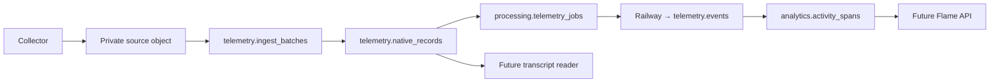
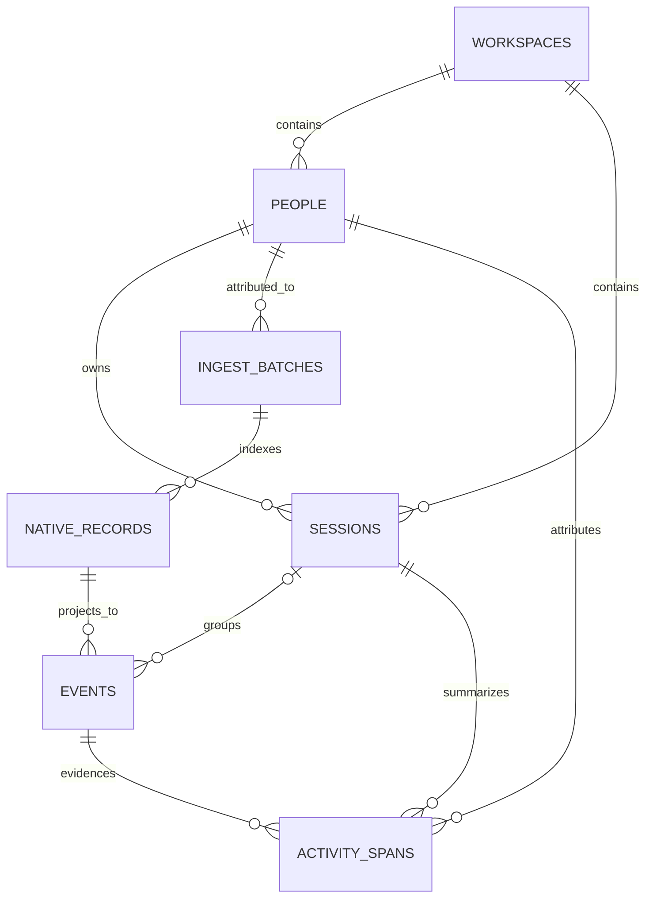

# Sherlock v0 Data Architecture

Status: the Supabase database foundation, rollout collector drain, asynchronous
Codex normalizer worker, and targeted versioned activity reducer are
implemented. The snapshot resolver, version activation, and Flame read APIs are
not.

Sherlock keeps raw telemetry immutable, database facts auditable, and product
views separate from source data. Seven source/product tables remain across two
private schemas, with one private operational queue table in `processing` and
one private Storage bucket.

## Sources of truth

Use these in order:

1. [`supabase/migrations`](../supabase/migrations) is authoritative for exact
   columns, constraints, indexes, roles, grants, and bucket configuration.
2. [`supabase/tests/database/schema.test.sql`](../supabase/tests/database/schema.test.sql)
   verifies the security and integrity properties on a real database.
3. This document explains responsibilities, relationships, and application
   behavior that SQL alone cannot enforce.

Do not copy the migration's full column or index lists into this document.
Keeping one exact definition prevents the architecture notes from drifting.

## Implemented foundation

- Supabase local configuration targets PostgreSQL 17.
- `telemetry` stores source receipts, native record locators, and normalized
  facts.
- `analytics` stores rebuildable activity projections.
- Both schemas are private and excluded from the configured Data API schemas.
- `public`, `anon`, and `authenticated` have no access to either schema or its
  tables and sequences.
- The private `telemetry-raw` bucket accepts gzip and binary objects up to
  50 MiB.
- Four no-login database roles separate ingest, normalization, reduction, and
  reads.
- Fifty-eight database assertions cover the core schema, grants, bucket, and
  representative integrity failures.
- The rollout collector and ingest function implement the versioned immutable
  batch and committed-receipt contract described below.
- The ingest request durably enqueues work and returns its existing receipt
  without waiting for normalization.
- Railway projects every native record with the immutable
  `sherlock.codex-rollout.v1` normalizer, then reduces only affected sessions
  into append-only `sherlock.activity.v1` span revisions.
- PostgreSQL automatically indexes bounded message excerpts as normalized
  event rows are inserted.

The migration does not create Storage object policies or a user-facing
permission model. Future services must connect server-side and assume only the
appropriate database role. If a private table is ever exposed through the Data
API, add explicit grants and row-level security together.

## Target data flow



The drain puts complete source bytes in Storage. PostgreSQL contains
immutable receipts and locators plus versioned interpretations. Complete
prompts, messages, reasoning, tool payloads, and native JSON do not belong in
database columns.

## Source, product, and operational tables

| Table | Responsibility | Writer behavior |
| --- | --- | --- |
| `telemetry.workspaces` | Team and tenant boundary | Provisioned administratively |
| `telemetry.people` | Stable human attribution inside a workspace | Server resolves normalized email and refreshes declared profile fields |
| `telemetry.sessions` | Current cache for one native Codex execution stream | Normalizer may insert and update |
| `telemetry.ingest_batches` | Receipt for one committed source byte range and Storage object | Ingest may insert only |
| `telemetry.native_records` | Exact locator and parse status for each native record | Ingest may insert only |
| `telemetry.events` | Versioned semantic projections of native records | Normalizer may insert only |
| `analytics.activity_spans` | Versioned, rebuildable activity intervals | Reducer may insert only |
| `processing.telemetry_jobs` | Mutable leases, retries, workload class, and terminal outcomes | Ingest trigger inserts; Railway transitions with fencing |

Append-only behavior is enforced for application roles through grants. A
database owner can still perform administrative maintenance and therefore
remains outside the application trust boundary.

### Relationships



Repeated `workspace_id` values use composite foreign keys where facts cross
tables. This prevents a child row from citing a person, session, batch, record,
or event from another workspace. A span's session and copied person must match
one session row, and span evidence is constrained to that same session.

### Sessions are mutable caches

A session represents one native Codex execution stream. Primary tasks and
workers are separate sessions. Resumes with the same native session ID update
the same row; a new native session ID creates another row and may share a
`native_thread_id`.

Resolved parent, role, title, repository, branch, working directory, model, and
time bounds are current caches. Historical queries must use versioned events
and spans rather than assuming those cached values were always true.

The first successfully normalized batch for a native session must determine
its person. A later batch with different immutable person attribution is an
application error; it must not rewrite `sessions.person_id`.

### Ingest batches and native records are source facts

An ingest batch identifies a non-empty half-open byte range `[start, end)`, its
source and stored hashes, the Storage path, encoding, generation, record count,
and server-resolved person attribution. Its `person_id` is fixed at commit time
and is never inferred again from mutable identity configuration.

Native records locate every source record, including unknown or malformed
ones. They remain separate from events because one native record may produce
multiple semantic events and later normalizer versions may reinterpret it.

The database enforces hashes, positive ranges and sizes, controlled values,
uniqueness, and tenant-consistent foreign keys. The drain must enforce the
cross-row stream rules described below.

### Events are versioned interpretations

Events are sparse, typed projections. Fields required by activity, usage,
health, lineage, and transcript queries are columns; small non-query labels may
use bounded JSON. Full content is retrieved through the native record and its
batch object.

`(source_record_id, normalizer_version, projection_index)` identifies one
projection. `session_id` is nullable because collector-only or unresolved
records may not yet have semantic session attribution. Unknown or irrelevant
records still need an `unknown` or `ignored` event so normalization coverage is
observable.

Normalizer versions must be immutable build or content identifiers. Mutable
aliases such as `latest` cannot reproduce an older interpretation.

### Activity spans are rebuildable

Activity spans are append-only revisions of logical intervals. A later row
with the same `span_key` and activity version supersedes an earlier row for a
newer event cutoff. Tombstones remove intervals for newer snapshots without
deleting history.

Spans copy the person, role, and event-time project dimensions needed by Flame
queries so those queries do not depend on mutable session caches. They are
still derived data: selected events plus an immutable `activity_version` must
be sufficient to rebuild them.

Flame frames and daily aggregates are not database facts and are not stored in
v0. A read response may be cached by immutable snapshot and query parameters.

## Database roles

| Role | Access |
| --- | --- |
| `sherlock_ingest` | Read workspace, person, batch, and native-record metadata; insert batches and native records |
| `sherlock_normalizer` | Read telemetry; insert/update session caches; insert events |
| `sherlock_reducer` | Read sessions and normalized events; select/insert activity spans |
| `sherlock_reader` | Read telemetry and analytics; no writes |

The ingest role cannot write events or spans. The normalizer cannot write spans.
The reducer cannot read raw receipts or native locators, change session caches
or events, or update/delete spans. The reader cannot write any fact. These
grants separate collection, interpretation, reduction, and product reads.

## Implemented rollout drain contract

`sherlock.rollout-batch.v1` and `sherlock.committed-receipt.v1` implement these
application rules without changing the seven-table schema:

1. Scope the public endpoint to its server-configured `workspace_id`. Normalize
   the declared email, resolve one `person_id` per workspace/email, and derive a
   machine-specific `collector_key` from the email plus persistent installation
   UUID. Never accept client-supplied IDs.
2. Durably spool a source chunk and its encoded object once. Retries must reuse
   the exact bytes rather than recompressing them.
3. Upload to a content-addressed path with overwrite disabled. If the object
   already exists, verify its stored size and hash before continuing.
4. In a short database transaction, lock the source stream and recheck the
   requested range. An exact identity, range, and hash retry returns the
   existing receipt; overlaps, conflicting hashes, and inconsistent generation
   mappings are rejected.
5. Insert the batch and all native-record locators atomically. Validate that
   record ranges are ordered, unique, contained by the batch, and equal the
   declared record count.
6. Return a versioned committed receipt containing the stable stream,
   generation, byte range, hashes, batch ID, and server-resolved attribution.
7. Delete the local spool item only after every receipt identity field matches.
   A successful Storage upload alone is not an acknowledgement.

Storage and database writes cannot be one transaction. Recovery must converge
in both expected failure windows:

- Storage succeeded but the database failed: verify the existing object and
  retry the database insert.
- The database committed but the response was lost: return the existing exact
  receipt.

An orphaned object from a rejected conflict is operational cleanup, not a
queryable telemetry fact.

## Implemented asynchronous normalization contract

The immutable object is written first. One database transaction then inserts
the batch, native locators, and an `AFTER INSERT` queue row. The existing receipt
returns after that durable acceptance. Railway re-downloads and revalidates the
object, upserts the session cache, and inserts one versioned event for every
native record. It then coalesces the latest event cutoff into one targeted
reduction job per affected session. The unique source-record/version/projection
key prevents duplicate events, and a coverage check rejects incomplete
projections.

Queue claims use `FOR UPDATE SKIP LOCKED`, visibility deadlines, heartbeats,
and fencing tokens. Caught failures retry with capped exponential backoff;
exhausted attempts remain inspectable as `failed`. Separate live/backfill
capacity prevents historical work from starving current ingestion.

The first version recognizes session metadata, turn context, user and assistant
messages, cumulative token usage, reasoning, common tool calls/results,
lifecycle records, native errors, and malformed/unknown records. Cumulative
usage separates cached input and reasoning output from the inclusive native
totals. Unknown records still produce observable `unknown` events.

Only the bounded message excerpt is copied into PostgreSQL and indexed with a
partial GIN full-text index. Full prompts, responses, reasoning, tool payloads,
and native JSON remain solely in immutable Storage and are recoverable through
their native-record locators.

The endpoint is intentionally unauthenticated. Anyone who knows its URL can
submit a valid batch and declare a name, GitHub login, and email; those values
are not proof of identity or email control. Batch `person_id` remains immutable
after commit, and two installations declaring the same normalized email resolve
to the same person.

## Implemented activity reducer contract

The Railway worker calls the reducer only for coalesced session IDs affected by
normalized batches.
`scripts/reduce-activity.ts` remains an explicit repair command, not a scheduler
or public API. It can capture a workspace event bound for manual rebuilds. The
targeted path pages a session's events by event ID, derives spans in memory,
then appends changed revisions in one short transaction per session. The
transaction assumes only `sherlock_reducer`, takes one transaction advisory lock
keyed by workspace, activity version, and session, and verifies any conflict row
byte-for-byte. Reducer failure cannot roll back or destabilize raw ingest or
normalization.

For one pinned immutable normalizer version, canonical selection:

1. excludes `is_replay = true`;
2. partitions events with both keys by session, canonical scope, logical event
   key, and event kind;
3. chooses source priority descending, then `occurred_at` ascending with nulls
   last, then event ID ascending; and
4. keeps every event without both canonical keys. It never deduplicates by
   content hash.

`sherlock.activity.v1` implements only timing supported by current Codex events.
Turn evidence with a `turn_id` uses lifecycle start/complete when available,
otherwise the canonical human message and terminal final response. Unkeyed task
lifecycle events pair FIFO. Tool calls/results pair by native call ID. A valid
increasing pair becomes an interval. An unpaired completed signal or
invalid-order pair becomes a one-second inferred point. An incomplete start
becomes a one-second `detected_open` provisional observation, which is passive
and must not be counted as exact active duration. Missing occurrence time falls
back to observed time and then server receipt time with the boundary marked
estimated; the reducer never uses `now()`.

Even paired v1 intervals have `confidence = inferred`: source timestamps record
boundary signals, not monotonic execution time or continuous attention.

Primary, worker, guardian, and automation sessions use identical rules and
remain separate sessions. Spans copy role and project from event evidence, copy
person from the owning session, retain start/end/cutoff event foreign keys, and
use session-namespaced logical keys. A later cutoff can append a corrected row
under the same key; a vanished interval gets a tombstone. Unchanged rows add no
revision, exact reruns are no-ops, and concurrent same-session attempts
converge.

The command supports a single-session bounded rebuild or a workspace rebuild:

```sh
SUPABASE_DB_URL=... deno run --allow-env --allow-net \
  scripts/reduce-activity.ts --workspace <uuid> \
  --normalizer-version sherlock.codex-rollout.v1 \
  --activity-version sherlock.activity.v1 \
  --through-event-id <id>
```

Omitting `--through-event-id` captures the greatest currently visible event ID
once at command start. This is a rebuild bound, not a durable incremental
watermark: global identity allocation does not prove commit order. Until
contiguous publication cutoffs exist, rerun bounded sessions/workspaces to pick
up a late commit. Algorithm changes use a new immutable activity version.
Rollback means stop producing/reading the new version; prior version rows are
untouched. Rebuild means rerun the desired scope and bound, never update or
delete source facts.

## Product adapters and deferred publication behavior

`apps/dashboard` provides a product-specific Flame adapter over a pinned
normalizer version. It reads versioned events directly, reports observed-event
coverage as partial, and does not turn the result into a durable publication
snapshot. This keeps the product view separate from the source-data contract.

The current implementation does not yet provide:

- activity-version activation;
- signed snapshot tokens and contiguous publication cutoffs;
- durable transcript, usage, health, or coverage publication APIs.

Implement each behavior in service code with integration tests. Do not describe
it as a database guarantee until a constraint or verified transaction protocol
actually enforces it.

## Conventions

- Entity IDs are UUIDs; high-volume append-only fact IDs are identity
  `bigint`s.
- Times are `timestamptz`. Source, observed, and server-received times remain
  distinct.
- Time and byte ranges are half-open: `[start, end)`.
- SHA-256 values are lowercase hexadecimal.
- Required identity text is non-empty.
- JSON is bounded and cannot replace typed fields used by core queries.
- Codex is the only provider in v0. Generalize after a second provider provides
  real requirements.
- Use keyset pagination for ordered fact reads.
- Do not partition until measured scale or retention work justifies it.

## Deferred

- end-user membership, authorization policies, and Data API read surfaces;
- separate installation, thread, run, edge, or classification tables;
- stored Flame frames, daily aggregates, builds, or snapshots;
- editable project and repository catalogs;
- incidents, alerts, transcript search, embeddings, and recommendations;
- multi-provider normalization, warehouse export, and partitioning.
- durable product snapshot cursors and generalized job orchestration;
- native wall/monotonic-duration precedence, hook tails, and presence streams
  until normalized events actually provide that evidence.

Deferring the user-facing permission model does not defer service
authentication, immutable attribution, or write isolation.

## Verification

After a schema change, rebuild or migrate a clean database and run:

```sh
supabase db query --linked --file supabase/tests/database/schema.test.sql
supabase db lint --linked --schema telemetry,analytics --level warning --fail-on error
supabase db advisors --linked --type all --level warn --fail-on error
```

The migration and tests must change together whenever the implemented contract
changes.
