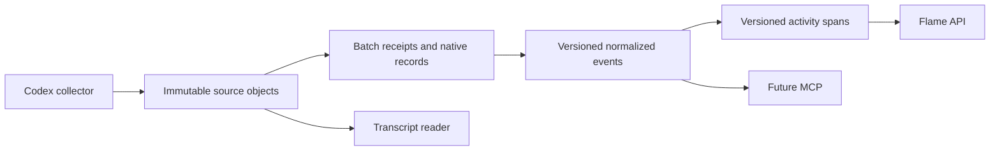

# Sherlock v0 Data Architecture

Status: proposed source-of-truth contract for the first Sherlock product.

Sherlock v0 tracks Codex sessions and powers a correct rebuild of the Flame
graph. It is deliberately not a general telemetry platform yet.

## Decision

Use three layers and keep product output out of the database:



- Object storage keeps the complete immutable Codex evidence.
- Postgres indexes source bytes and their versioned semantic interpretation.
- Activity spans are a rebuildable projection. Flame frames, summaries, and
  MCP responses remain derived results.
- Expensive read results may be cached by snapshot token and query parameters;
  they are not new facts.

## Complexity budget

V0 has **seven tables**:

1. `telemetry.workspaces`
2. `telemetry.people`
3. `telemetry.sessions`
4. `telemetry.ingest_batches`
5. `telemetry.native_records`
6. `telemetry.events`
7. `analytics.activity_spans`

It has at most four supported read contracts. An eighth table requires a
measured workload or a query that these seven cannot answer correctly.

V0 intentionally has:

- one `sessions` table, not separate thread, run, edge, installation, and
  classification tables;
- one sparse typed `events` table for messages, tools, usage, lifecycle,
  presence, heartbeats, and stream watermarks;
- one append-only activity-span projection, not stored Flame buckets or daily
  aggregates;
- no triggers, partitions, or build/snapshot tables;
- no permission, incident, project, provider, search, recommendation, or
  MCP-specific tables.

## Conventions

- Entity IDs are UUIDs. High-volume append-only fact IDs are identity
  `bigint`s.
- All times are `timestamptz`. Source, collector-observed, and server-received
  times stay distinct.
- Time and byte ranges are half-open: `[start, end)`.
- Hashes are lowercase hexadecimal SHA-256.
- Complete prompts, messages, reasoning, tool payloads, and native JSON never
  live in Postgres.
- `ingest_batches`, `native_records`, `events`, and `activity_spans` are
  append-only. Re-normalization and span correction append new versions; they
  never rewrite old facts.
- Every foreign key is indexed. Repeated `workspace_id` values use composite
  foreign keys so child and parent workspaces cannot disagree.
- JSONB is limited to small labels that are not used by core queries.
- Codex is the only provider in v0. Generalize after a second provider supplies
  real requirements.

## Tables

### `telemetry.workspaces`

A lightweight team and query boundary. V0 can contain one row; this is not a
permission model.

| Column | Type | Notes |
| --- | --- | --- |
| `id` | `uuid` | Primary key |
| `slug` | `text` | Unique stable key |
| `name` | `text` | Display name |
| `created_at` | `timestamptz` | Required |

### `telemetry.people`

The stable human attribution used for team-wide and person-wide statistics.

| Column | Type | Notes |
| --- | --- | --- |
| `id` | `uuid` | Primary key |
| `workspace_id` | `uuid` | FK to `workspaces` |
| `identity_key` | `text` | Stable collector identity |
| `display_name` | `text` | Nullable |
| `email` | `text` | Nullable normalized email |
| `created_at` | `timestamptz` | Required |

Unique: `(workspace_id, identity_key)` and `(workspace_id, id)`.

### `telemetry.sessions`

One row is one native Codex execution stream. A primary task and every worker
are separate sessions.

| Column | Type | Notes |
| --- | --- | --- |
| `id` | `uuid` | Primary key |
| `workspace_id` | `uuid` | FK to `workspaces` |
| `person_id` | `uuid` | Composite FK to `people` |
| `collector_key` | `text` | Stable installation/device key |
| `native_session_id` | `text` | Codex execution identifier |
| `native_thread_id` | `text` | Nullable conversation/resume grouping |
| `parent_session_id` | `uuid` | Nullable resolved self FK cache |
| `parent_native_session_id` | `text` | Nullable child-first parent evidence |
| `actor_role` | `text` | Current `primary`, `worker`, `guardian`, `automation`, or `unknown` cache |
| `role_version` | `text` | Current classifier version cache |
| `title` | `text` | Nullable current label |
| `project_key` | `text` | Nullable current repo/path grouping |
| `repo_remote` | `text` | Nullable current context |
| `branch` | `text` | Nullable current context |
| `cwd` | `text` | Nullable current context |
| `model` | `text` | Nullable current context |
| `started_at` | `timestamptz` | First known source activity cache |
| `ended_at` | `timestamptz` | Nullable explicit end cache |
| `created_at` | `timestamptz` | Required |
| `updated_at` | `timestamptz` | Required |

Unique: `(workspace_id, collector_key, native_session_id)` and
`(workspace_id, id)`.

A resume with the same native session ID remains the same row and appears as
lifecycle events. If Codex emits a new session ID, it becomes a new row that can
share `native_thread_id` with the earlier execution.

`parent_native_session_id` preserves child-before-parent evidence. Resolved
parent, role, title, and repository fields are current caches only. Snapshot
queries derive lineage, role, and event-time project context from selected
events, so later cache updates cannot change an existing result.

### `telemetry.ingest_batches`

One immutable, successfully committed source chunk and its object receipt.
Failed attempts stay in operational logs rather than the product model.

| Column | Type | Notes |
| --- | --- | --- |
| `id` | `uuid` | Primary key and receipt ID |
| `workspace_id` | `uuid` | FK to `workspaces` |
| `collector_key` | `text` | Source installation/device |
| `observed_native_session_id` | `text` | Nullable immutable collector hint |
| `source_kind` | `text` | `rollout`, `hook`, or `collector` |
| `source_stream_key` | `text` | Stable key within source kind |
| `generation_key` | `text` | Immutable native generation identity |
| `generation_seq` | `bigint` | Monotonic order within the stream |
| `start_offset` | `bigint` | Inclusive uncompressed source offset |
| `end_offset` | `bigint` | Exclusive uncompressed source offset |
| `source_byte_count` | `bigint` | Equals `end_offset - start_offset` |
| `source_sha256` | `text` | Hash of uncompressed source bytes |
| `storage_path` | `text` | Unique immutable object path |
| `storage_encoding` | `text` | `gzip` or `identity` |
| `stored_byte_count` | `bigint` | Encoded object size |
| `stored_sha256` | `text` | Hash of stored object bytes |
| `record_count` | `integer` | Positive; records beginning in this range |
| `first_occurred_at` | `timestamptz` | Nullable source time |
| `last_occurred_at` | `timestamptz` | Nullable source time |
| `codex_version` | `text` | Nullable |
| `collector_version` | `text` | Nullable |
| `contract_version` | `text` | Required |
| `committed_at` | `timestamptz` | Required server time |

Unique:

- `(workspace_id, collector_key, source_kind, source_stream_key, generation_seq,
  generation_key, start_offset, end_offset)` identifies a range;
- `(workspace_id, id)` supports tenant-consistent child FKs;
- `storage_path` identifies one object.

An exact retry with the same range and hash returns the existing receipt. A
conflicting range or hash is rejected under a lock scoped to workspace,
collector, source kind, and stream. Under that lock, the ingest service also
enforces one generation key per sequence and one sequence per key. Truncation
or replacement starts the next `generation_seq`; opaque generation keys are
never sorted lexically.

There is deliberately no resolved `session_id` here. Source receipts remain
immutable; versioned events own semantic session attribution.

### `telemetry.native_records`

One immutable locator for every native record, including unknown and malformed
records. This is source identity, not interpretation.

| Column | Type | Notes |
| --- | --- | --- |
| `id` | `bigint` | Identity primary key |
| `workspace_id` | `uuid` | Composite FK to batch workspace |
| `batch_id` | `uuid` | FK to `ingest_batches` |
| `record_index` | `integer` | Order within the batch |
| `source_start_offset` | `bigint` | Inclusive stream offset |
| `source_end_offset` | `bigint` | Exclusive stream offset |
| `record_sha256` | `text` | Exact native record hash |
| `native_type` | `text` | Nullable exact native label |
| `native_payload_type` | `text` | Nullable exact payload label |
| `occurred_at` | `timestamptz` | Nullable native time |
| `parse_status` | `text` | `ok`, `unknown`, or `malformed` |
| `created_at` | `timestamptz` | Required |

Unique: `(batch_id, record_index)`, `(batch_id, source_start_offset)`, and
`(workspace_id, id)`.

Keeping native records separate from events is non-negotiable: one record can
produce several semantic events, and later normalizers must reinterpret it
without changing source history.

### `telemetry.events`

An append-only, versioned semantic projection of a native record. The table is
intentionally sparse; fields that drive Flame and MCP queries are typed.

| Column group | Fields |
| --- | --- |
| Identity | `id`, `workspace_id`, `session_id`, `source_record_id`, `normalizer_version`, `projection_index` |
| Canonicalization | `canonical_scope_key`, `logical_event_key`, `source_priority`, `is_replay` |
| Classification | `event_kind`, `event_subtype`, `phase`, `actor_role` |
| Timing | `occurred_at`, `observed_at`, `server_received_at`, `wall_started_at`, `wall_ended_at`, `native_duration_ms` |
| Native links | `native_item_id`, `turn_id`, `tool_call_id`, `related_session_id` |
| Message/tool | `message_role`, `message_origin`, `tool_name`, `tool_status` |
| Context | `model`, `project_key`, `repo_remote`, `branch`, `cwd` |
| Usage | `usage_stream_key`, `usage_scope`, `usage_is_cumulative`, `input_tokens`, `cached_input_tokens`, `output_tokens`, `reasoning_tokens`, `total_tokens` |
| Collector state | `collector_key`, `lease_state`, `source_kind`, `source_stream_key`, `generation_seq`, `observed_size`, `captured_offset`, `committed_offset`, `pending_record_count`, `pending_byte_count`, `error_code` |
| Content index | `content_sha256`, `content_byte_size`, `content_excerpt` |
| Extension | `attributes`, `created_at` |

Required uniqueness:

`(source_record_id, normalizer_version, projection_index)`.

Every record processed by a normalizer emits at least one event. A record with
no product meaning emits an `ignored` sentinel; an uninterpretable record emits
`unknown`. All projections for one `(source_record_id, normalizer_version)` are
computed and inserted in one transaction while holding the workspace lock;
after commit that pair/version is sealed against more events. This makes full
normalization completeness observable without another receipt table.

`session_id` is the nullable, versioned resolved attribution; collector-only
and unresolved events may leave it null. `content_excerpt` is at most 1 KiB and
`attributes` at most 8 KiB. Full content is resolved through the native record
and batch object.

Core event kinds are `message`, `reasoning`, `tool_call`, `tool_result`,
`agent_spawn`, `agent_message`, `usage`, `lifecycle`, `collector_heartbeat`,
`session_presence`, `stream_watermark`, `error`, `ignored`, and `unknown`.

Core message origins are `human`, `parent_agent`, `worker`, `system`,
`resumed_context`, and `unknown`.

Hook/rollout duplicates and replayed fork ancestors remain separate source
facts. Canonical selection applies only when both keys are non-null and
partitions by:

```text
(canonical_scope_key, normalizer_version, logical_event_key, event_kind)
```

`canonical_scope_key` normally identifies the native conversation/fork family,
allowing inherited replay in a child to resolve to its original event without
deduplicating unrelated sessions. Selection uses source priority, then source
time, then event ID as deterministic tie-breakers. A non-null logical key
requires a non-null canonical scope; otherwise the event is invalid. Unkeyed
events are never deduplicated, and `is_replay` events never create new
activity, prompts, or usage.

Collector heartbeats and watermarks enter through `source_kind = 'collector'`
and the same immutable batch/record path as every other fact. Client samples
report observed size, locally captured offset, and last acknowledged committed
offset. Normalized coverage is derived from native records and sentinel events;
the client does not claim it.

### `analytics.activity_spans`

An append-only, rebuildable projection of intervals during which one session
was active or merely detected as open. Flame reads spans instead of repeatedly
reconstructing lifecycle and tool pairs from events.

| Column | Type | Notes |
| --- | --- | --- |
| `id` | `bigint` | Identity primary key |
| `workspace_id` | `uuid` | Composite tenant FK |
| `session_id` | `uuid` | Composite FK to `sessions` |
| `person_id` | `uuid` | Copied composite FK to `people` |
| `span_key` | `text` | Stable logical interval key |
| `activity_version` | `text` | Reducer algorithm version |
| `valid_from_event_id` | `bigint` | Composite event FK that introduced this version |
| `started_at` | `timestamptz` | Nullable only for a tombstone |
| `ended_at` | `timestamptz` | Nullable only for a tombstone; exclusive |
| `span_state` | `text` | `active` or `detected_open` |
| `activity_kind` | `text` | `turn`, `tool`, `point`, `hook_tail`, or `presence` |
| `timing_basis` | `text` | `lifecycle`, `native_duration`, `paired_events`, `point`, or `provisional` |
| `confidence` | `text` | `exact` or `inferred` |
| `estimated_start` | `boolean` | Required |
| `estimated_end` | `boolean` | Required |
| `actor_role` | `text` | Role under this activity version |
| `project_key` | `text` | Nullable event-time grouping |
| `start_event_id` | `bigint` | Nullable composite evidence FK |
| `end_event_id` | `bigint` | Nullable composite evidence FK |
| `is_tombstone` | `boolean` | Removes an earlier span at this cutoff |
| `created_at` | `timestamptz` | Required |

Unique:

`(workspace_id, activity_version, span_key, valid_from_event_id)`.

`span_key` identifies the same logical interval across corrections. A tool-call
point and the later exact call/result interval therefore share a key. The later
row replaces the earlier row for newer snapshots without deleting audit
history. A tombstone removes an interval that later evidence proves should not
exist. Non-tombstones require `ended_at > started_at`; tombstones require both
times to be null. All cited events must belong to the same workspace and
session and have IDs at or below `valid_from_event_id`.

For a snapshot, select the greatest `valid_from_event_id <= event_cutoff_id`
for each `(activity_version, span_key)`, then discard tombstones and intervals
outside the requested window. To keep this bounded, first find span keys with
any historical version overlapping the window, then use the span-key/version
index to fetch their latest eligible rows.

When normalization commits a record's events, the activity reducer recomputes
every affected `span_key` and inserts any new span versions in that same
transaction while holding the workspace lock. `valid_from_event_id` is the
greatest triggering event ID. Thus an event cutoff can never expose an event
without its corresponding current span version.

Only fully backfilled activity versions become active. To introduce a new
version, rebuild it from the selected canonical events, validate it through the
acceptance suite, then atomically switch the server's active version. Existing
tokens keep their old version and remain reproducible while those span rows are
retained.

Spans copy the person, role, and event-time project dimensions required by the
graph so Flame does not depend on mutable session caches. They remain derived:
the selected events and `activity_version` can rebuild them completely.

## Immutable query snapshots

The first read resolves a signed snapshot token containing:

```text
workspace_id
native_record_cutoff_id
event_cutoff_id
normalizer_version
activity_version
issued_at
```

No snapshot table is required. Correct cutoffs use a short per-workspace
advisory transaction lock shared by batch registration, event-and-span
projection, and snapshot resolution:

1. Writers acquire the lock before allocating record or event IDs.
2. The normalizer version is immutable, emits at least one projection per
   selected record, and writes affected span versions in the same transaction.
3. While holding the lock, the resolver chooses the greatest contiguous record
   cutoff for which every record has a sealed projection set, then the matching
   event cutoff.
4. The server signs the token. Later writes receive greater IDs and cannot
   change rows selected by the token.

Every selected event must satisfy all of: matching workspace and normalizer,
`events.id <= event_cutoff_id`, and its joined
`native_records.id <= native_record_cutoff_id`. This prevents an early event
for a later, out-of-order record from leaking beyond the complete source
prefix. Coverage uses only batches reached through selected native records;
zero-record batches are rejected at ingest. All overview, detail, timeline,
transcript, usage, health, and coverage reads apply this same fence. Clients
cannot forge or widen a token. A cache key includes the complete token plus
canonical query parameters.

Every selected span must match the token's workspace and `activity_version`.
Its `valid_from_event_id` must be at or below the event cutoff, and the latest
eligible version of its `span_key` wins. New evidence can append corrected
spans but cannot change the result of an older token.

## Activity reducer and Flame contract

The `activity_version` names deterministic service code that converts canonical
events into the versioned half-open intervals stored in `activity_spans`.

Derivation order is:

1. exact native lifecycle bounds;
2. native monotonic duration, end-aligned when wall bounds include suspension;
3. paired call/result or start/end events using native call and turn IDs;
4. a one-second point for an unpaired rollout signal;
5. an explicitly estimated hook-only tail capped at 60 seconds.

Passive `detected_open` presence is a different interval state. It never
contributes to active seconds, active concurrency, or token rates.

All Flame windows are `[start_at, end_at)`:

- **Person active seconds:** clip active intervals to the window, then union
  them across all of that person's sessions. The result cannot exceed the
  wall-clock window.
- **Agent session seconds:** union within each session, then sum sessions. This
  can exceed wall time when workers run concurrently.
- **Team person seconds:** sum person active seconds. Do not confuse it with
  unioned team coverage.
- **Session count:** distinct sessions with qualifying active intervals.
- **Peak concurrency:** union each session's intervals, then sweep endpoints,
  processing ends before starts at equal timestamps.
- **Role peaks:** calculate each role's peak independently. Role composition at
  the overall peak is the exact active set at that point.
- **Human prompts:** canonical, non-replay messages with
  `message_origin = 'human'`. Delegation wrappers and resumed context do not
  count even if their native role is `user`.
- **Usage:** partition cumulative counters by session, stream, scope, and model.
  Use the observation immediately before the range as baseline; a decreasing
  counter is a reset and contributes its current value. Missing baselines are
  reported as partial, not guessed.

The Flame UI chooses display resolution, including ten-minute frames. Frames
are never stored as telemetry facts. Window queries read the latest eligible
span version per key, then union intervals and calculate buckets, concurrency,
and peaks. The completed response may still be cached by snapshot and query.

## Supported read contracts

1. `flame_window(workspace_id, start_at, end_at, snapshot_token?)`
2. `flame_frame_detail(snapshot_token, frame_start, frame_end, filters)`
3. `session_timeline(snapshot_token, session_id, cursor, content_mode)`
4. `usage(snapshot_token, scope, start_at, end_at, cursor)`

The first call returns the resolved snapshot token. Every later call reuses it
and reports `ok`, `partial`, `unavailable`, or `no_data` plus coverage gaps.
Zero is returned only when coverage is complete.

`session_timeline` owns both metadata and bounded content retrieval, so the
transcript reader is not a hidden fifth contract. With `content_mode =
selected`, it:

1. joins events to source records and applies both token cutoffs plus the
   selected workspace and normalizer version;
2. resolves the corresponding committed batch objects only;
3. orders them by source kind, stream, `generation_seq`, and byte offset;
4. verifies hashes, decompresses, and slices exact source ranges;
5. returns content with record ID, byte range, and hash citations.

Unknown and malformed record locators are included when their batch's immutable
native-session hint matches the requested session. Newer records never appear
under an older token.

The future MCP is a thin service over these four contracts. It can expose
team-, person-, session-, and `project_key`-wide usage, transcripts, and cited
feedback without acquiring its own fact schema.

## Minimal indexes

```text
people(workspace_id, identity_key) unique

sessions(workspace_id, collector_key, native_session_id) unique
sessions(workspace_id, person_id, started_at, id)
sessions(workspace_id, parent_session_id, started_at, id)
  where parent_session_id is not null

ingest_batches(workspace_id, collector_key, source_kind, source_stream_key,
               generation_seq, generation_key, start_offset, end_offset) unique
ingest_batches(workspace_id, id) unique

native_records(batch_id, source_start_offset) unique
native_records(workspace_id, occurred_at, id)

events(source_record_id, normalizer_version, projection_index) unique
events(workspace_id, session_id, occurred_at, id)
events(workspace_id, canonical_scope_key, normalizer_version,
       logical_event_key, event_kind, source_priority desc, id)
  where canonical_scope_key is not null and logical_event_key is not null
events(workspace_id, occurred_at, id)
  where event_kind = 'message' and message_origin = 'human'
events(workspace_id, related_session_id, occurred_at, id)
  where related_session_id is not null
events(workspace_id, collector_key, server_received_at desc, id desc)
  where event_kind in ('collector_heartbeat', 'stream_watermark')

activity_spans(workspace_id, activity_version, span_key,
               valid_from_event_id desc) unique
activity_spans(workspace_id, activity_version, started_at, ended_at, span_key)
  where is_tombstone = false
activity_spans(workspace_id, session_id, activity_version, started_at, id)
activity_spans(workspace_id, person_id, activity_version, started_at, id)
activity_spans(workspace_id, valid_from_event_id)
activity_spans(workspace_id, start_event_id) where start_event_id is not null
activity_spans(workspace_id, end_event_id) where end_event_id is not null
```

Use keyset pagination with `(occurred_at, id)`. Do not partition until fact
tables approach measured operational thresholds, such as roughly 100 million
rows, or retention maintenance justifies it.

## Storage and ingest contract

Use a private immutable bucket and content-addressed paths:

```text
workspaces/{workspace_id}/collectors/{collector_key}/
  {source_kind}/{source_stream_key}/generations/{generation_seq}-{generation_key}/
    {start_offset}-{end_offset}-{source_sha256}.jsonl.gz
```

The ingest path is intentionally short:

1. Receive and validate one normally newline-aligned source chunk.
2. Under the stream lock, reject conflicting overlap or identify an exact
   retry.
3. Upload to a new immutable path with overwrite disabled.
4. Verify source and stored sizes and hashes.
5. Insert the committed batch and all native record locators transactionally.
6. Return the receipt; the collector deletes its spool item only after
   validating it.

Oversized records use a dedicated object rather than truncation. Malformed,
unknown, and child-before-parent evidence is never rejected for lacking a
semantic session or parent.

## Deferred until a product proves it needs them

- authentication, roles, RLS policies, and membership history;
- separate installations, threads, runs, generic edges, and claim tables;
- frame, daily aggregate, build, and snapshot tables;
- editable project and repository catalogs;
- incident and alert persistence;
- multi-provider normalization;
- transcript search, embeddings, and recommendation storage;
- warehouse exports and table partitioning.

The application server can use private schemas and a direct database
connection in v0. If Supabase Data API access is added, migrations must include
explicit grants; new public tables are no longer automatically exposed. Grants
and RLS remain separate concerns.

## Acceptance tests

- Primary session, nested workers, child-before-parent arrival, same-ID resume,
  and new-ID resume sharing `native_thread_id`.
- Exact lifecycle bounds, suspension-aware end-aligned duration, paired
  call/result, missing-pair one-second point, capped hook tail, and passive-only
  presence.
- A one-second provisional span is replaced by an exact span under the same
  `span_key`; the old snapshot retains the point and the new snapshot sees the
  exact interval.
- Fork replay and hook/rollout duplicates remain in source evidence but count
  once in activity, prompt, and usage results.
- A delegation wrapper with native user role does not count as a human prompt;
  a genuine human prompt does.
- Cumulative usage `100 -> 130 -> 5` yields deltas `30` and reset delta `5`,
  with streams, scopes, and models isolated.
- Snapshot A remains byte- and count-stable for frame, detail, transcript,
  usage, health, and coverage reads after new data creates snapshot B.
- A native record normalized to no semantic event emits `ignored`, proving
  completeness at the selected cutoff.
- Exact retry is idempotent; conflicting overlap or hash is rejected;
  truncation increments `generation_seq`; missing ranges remain visible.
- Fresh lease with no output, missing heartbeat, capture stall, upload stall,
  and normalization stall remain distinguishable.
- Person-, session-, team-, and project-key aggregation handles overlapping
  workers without double counting.
- Complete transcripts round-trip from immutable objects using record offsets
  and hashes.

## Supabase references

- [Storage](https://supabase.com/docs/guides/storage)
- [S3 compatibility](https://supabase.com/docs/guides/storage/s3/compatibility)
- [Data API grants change](https://supabase.com/changelog/45329-breaking-change-tables-not-exposed-to-data-and-graphql-api-automatically)
